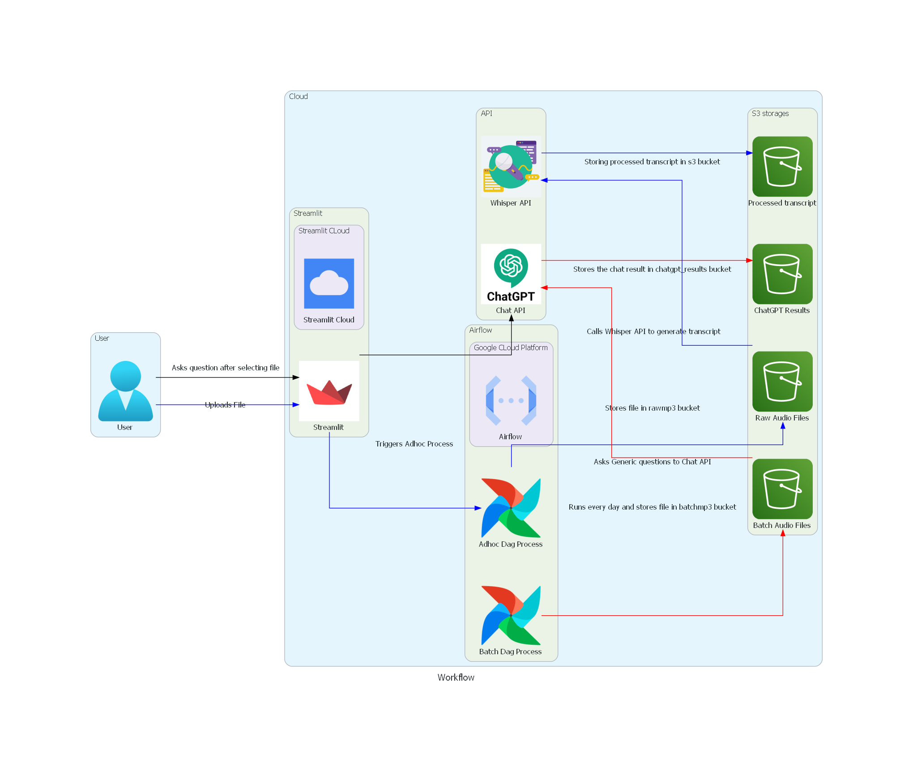

## CONVOFLOW-AI

CONVOFLOW-AI is a model-as-a-service project that provides a user-friendly platform for uploading audio files, processing their content, and asking questions based on summarized text. Leveraging advanced machine learning APIs, this Streamlit application allows users to interact with audio content effortlessly, whether by generating relevant questions or providing their own.

## Technology Stack
- Streamlit: For building an interactive front-end.
- Airflow: Used for orchestration and managing ad-hoc and batch processing workflows.
- ChatGPT API: Provides intelligent responses to user questions about the audio content.
- Whisper API: Used for converting audio to text with high accuracy.

## Project Description
CONVOFLOW-AI is designed to streamline interaction with audio files through:

- Audio Processing: Converts audio files into text summaries.
- Question Generation: Provides generic questions based on the audio content.
- Custom Querying: Users can also submit their own questions to gain insights from the summarized text.
- Audio History: Stores uploaded audios for later retrieval, enabling users to revisit and explore previously processed content.

## The backend leverages:

- ChatGPT API: For generating natural language responses to user questions.
- Whisper API: For high-accuracy audio-to-text conversion.
- Airflow: For orchestrating ad-hoc and batch audio processing workflows, ensuring scalability and efficiency.
This application offers an intuitive experience, for navigating audio content, asking questions, and accessing saved audio files.

## Features
- Audio Upload: Easily upload or record audio files directly in the app.
- Text Summarization: Automatic transcription and summarization of audio files using Whisper API.
- Question Answering: Ask questions about the audio content with ChatGPT-generated responses.
- Storage & Retrieval: Save audio files to access and interact with them later.

## Steps to Run the Code
1. Clone the Repository:
git clone https://github.com/BigDataIA-Spring2023-Team-01/Model-as-a-service.git

2. Create a Virtual Environment:
bash
python -m venv <Virtual_environment_name>

3. Activate Virtual Environment and Install Requirements:
bash
pip install -r /path/to/requirements.txt

4. Run the Streamlit Application: Navigate to the project root:
bash
cd CONVOFLOW-AI

5. Then start the application:
bash
streamlit run streamlit/main.py

